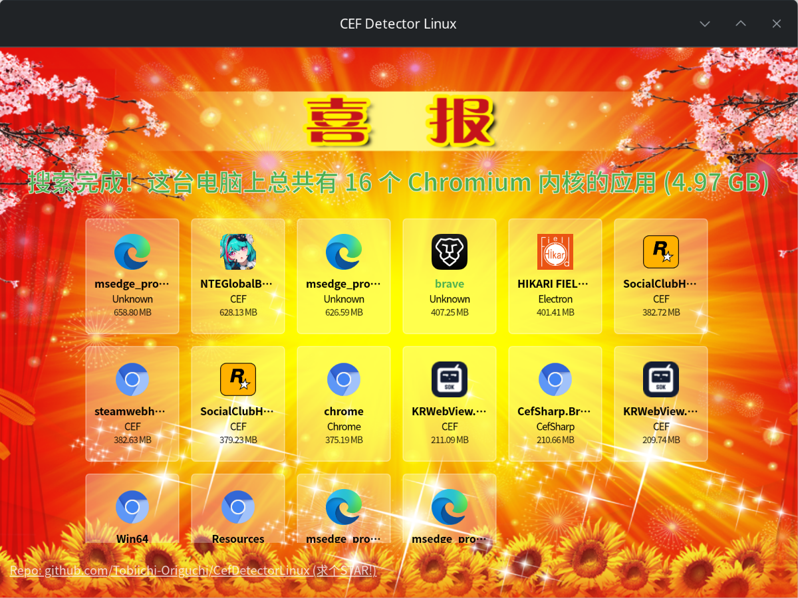

# CEF Detector Linux - 一眼CEF Linux: 年轻人的第一款 Linux CEF检测器 [](https://github.com/Tobiichi-Origuchi/CefDetectorLinux/actions/workflows/release.yml)

Check how many CEFs are on your Linux

**【使用 rust 编写，专为 Linux 打造】**

看看你电脑 **(Linux)** 上有多少个 [CEF (Chromium Embedded Framework)](https://github.com/chromiumembedded/cef)

> **Note**
> 欢迎你把程序截图发到 [Discussions](https://github.com/Tobiichi-Origuchi/CefDetectorLinux/discussions) 中, 看看谁才是真的 **《超级CEF王》**

> 你说的对，但是《LibCEF》是由谷歌自主研发的一款全新开放浏览器内核。第三方代码运行在在一个被称作「CEF」的浏览器沙盒，在这里，被前端程序员选中的代码将被授予「libcef.so」，导引浏览器之力‌。你将扮演一位名为「电脑用户」的冤种角色，在各种软件的安装中下载类型各异、体积庞大的 CEF 们，被它们一起占用硬盘空间，吃光你的内存——同时，逐步发掘「CEF」的真相

## 截屏



## 安装

### Debian

从 [Release](https://github.com/Tobiichi-Origuchi/CefDetectorLinux/releases) 页面下载最新的 `.deb` 包安装

### Arch Linux

```bash
yay/paru -S cefdetector-bin
```

## 使用

### GUI

```bash
cefdetector
```

### Cli

例如以 JSON 格式打印

```bash
cefdetector --json
```

使用 `cefdetector --help` 查看更多用法

## 特性

- 检测 CEF 的类型: 如 [libcef](https://github.com/chromiumembedded/cef)、[Electron](https://www.electronjs.org/)、[NWJS](https://nwjs.io/)、[CefSharp](http://cefsharp.github.io/)、[MiniBlink](https://github.com/weolar/miniblink49)、[MiniElectron](https://github.com/weolar/miniblink49)、[Edge](https://www.microsoft.com/en-us/edge) 和 [Chrome](https://www.google.com/chrome/)
- 检测应用图标: 通过解析 PE、AppImage、同级目录、快捷方式、包管理器（目前仅支持 APT/Pacman/RPM/Portage/Flatpak/Snap/Nix/Brew）
- 显示总空间占用
- 显示当前所运行的进程 (绿色文件名)
- 单独显示每个程序的空间占用并按大小排序

## 作者

Origuchi

创意来自 @Lakr233 的 [SafariYYDS](https://github.com/Lakr233/SafariYYDS) 及 @ShirasawaSama 的 [CefDetectorX](https://github.com/ShirasawaSama/CefDetectorX) 项目

## 协议

[MIT](./LICENSE)
